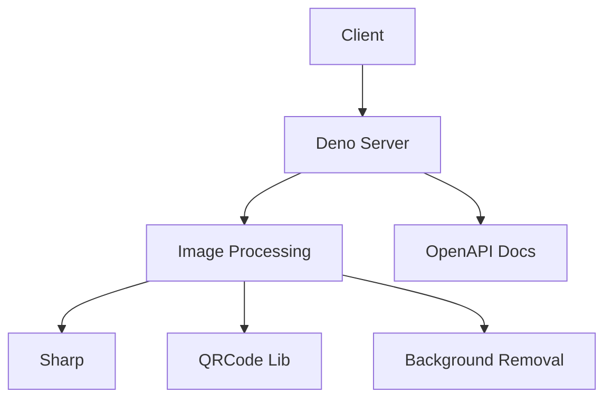

# Imagify 🚀

**Advanced Image Processing API**  
*Transform, manipulate, and analyze images with a powerful Deno-based API*

[](https://deno.land)
[](LICENSE)
[](https://swagger.io/specification/)

  

---

## 🔥 Features

- **20+ Image Tools** – Resize, crop, blur, QR codes, filters, watermarking, and more!
- **Lightning Fast** – Built with Deno and Sharp for high-performance processing.
- **RESTful API** – Standardized endpoints with OpenAPI 3.1 documentation.
- **Easy Integration** – JSON responses and webhooks support.

---

## 📦 Endpoints Overview

| Category       | Endpoints                                                                 |
|----------------|---------------------------------------------------------------------------|
| **Generation** | `/color`, `/qrcode`                                                       |
| **Effects**    | `/blur`, `/filter`, `/invert`, `/text-watermark`, `/remove-bg`            |
| **Transforms** | `/resize`, `/crop`, `/rotate`, `/composite`                              |
| **Analysis**   | `/metadata`, `/compare`, `/face-detection`                                |
| **Conversion** | `/to-pdf`                                                                 |

**[Full API Reference →](#api-documentation)**

---

## 🛠️ Quick Start

### Prerequisites
- Deno `^1.40.0`
- Node.js `^18.0.0` (for Sharp)

### Installation
```bash
git clone https://github.com/appujet/imagify.git
cd imagify
deno task start
```

---

## 🌟 Example Usage

### Generate a Color Image
```bash
curl "http://localhost:8000/api/v1/color?color=FF5733&width=800&height=600"
```

### Add a Watermark
```bash
curl -X POST -F "image=@photo.jpg" -F "text=Confidential" \
  "http://localhost:8000/api/v1/text-watermark"
```

### Remove Background
```bash
curl -X POST -F "image=@portrait.png" \
  "http://localhost:8000/api/v1/remove-bg"
```

---

## 📚 API Documentation

Interactive Swagger UI:  
`http://localhost:8000/`  

[]()

---

## 🏗️ Architecture



---

## 🤝 Contributing

1. Fork the project
2. Create a branch (`git checkout -b feat/amazing-feature`)
3. Commit changes (`git commit -m 'Add amazing feature'`)
4. Push (`git push origin feat/amazing-feature`)
5. Open a PR

---

## 📜 License

MIT © [Your Name](https://github.com/your-username)


---

### Key Sections:
1. **Eye-catching badges** for Deno, OpenAPI, and license.
2. **Feature highlights** in a concise table.
3. **Code snippets** with cURL examples.
4. **Visual placeholders** (replace with actual screenshots).
5. **Mermaid diagram** for architecture (renders on GitHub).
6. **Clean contribution guidelines**.

---